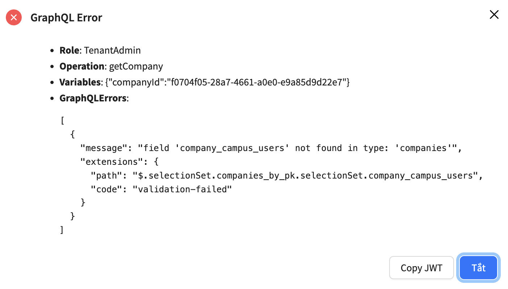
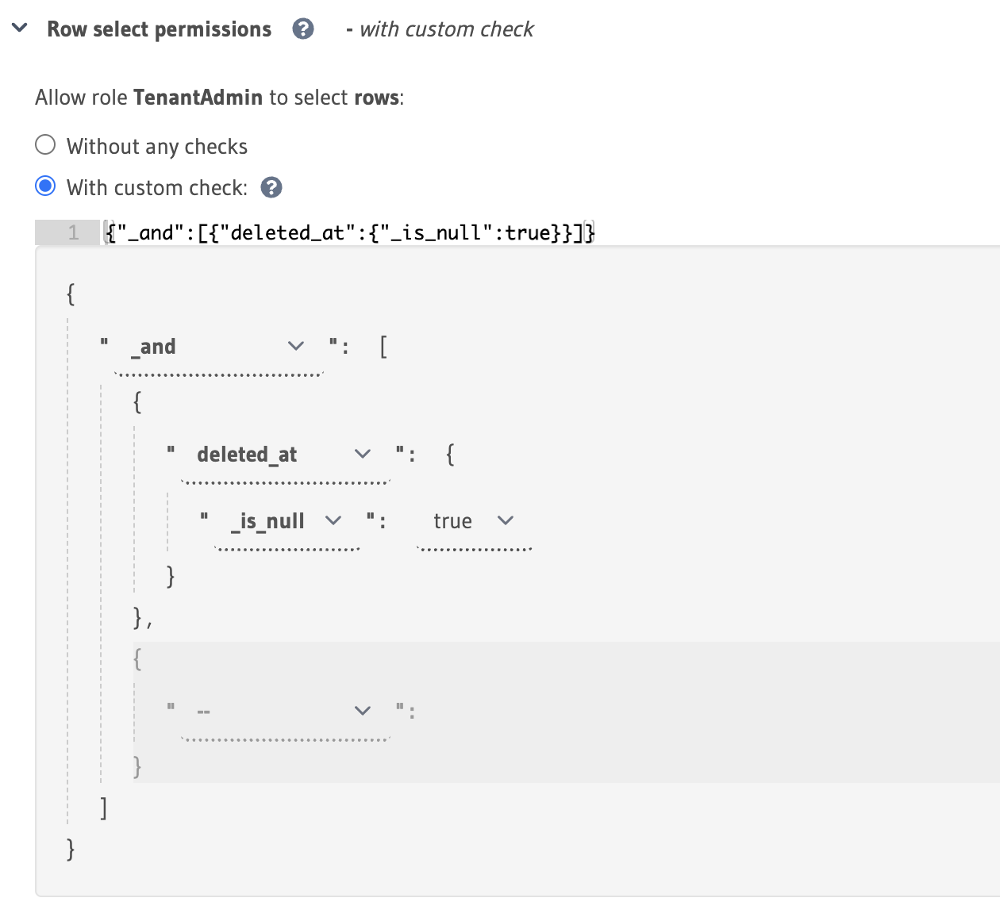
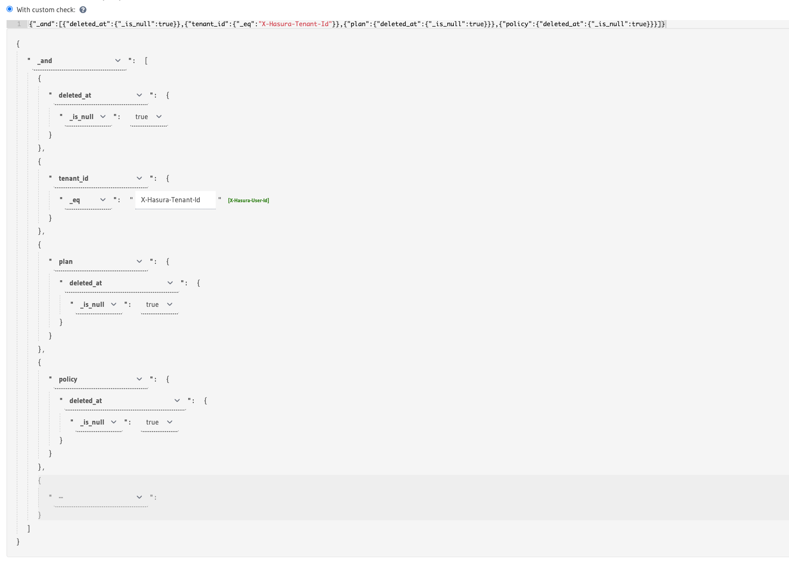

# Hasura

## Rules

- Data never gets deleted, only marked as deleted. In other words, always use soft delete. https://hasura.io/docs/latest/schema/common-patterns/data-modeling/soft-deletes/
- Table names should always end with plurals.
- Many-to-many tables should be named `authors_books` (both words as plurals).
- Name tables so that they sit alongside each other in a group when viewing in Hasura Console or any database IDE. For example, `authors`, `authors_books`, `books`, `books_categories`, `categories`.

## Table Creation
### Mandatory columns

- id: UUID, use generate_random_uuid(). Even many-to-many tables should have an id column. Exceptions should only be made if you know what you are doing. Exception: Enum tables.
- created_at: use Hasura suggestion.
- created_by: set up using Hasura's `x-hasura-user-id` header: https://hasura.io/docs/latest/auth/authorization/permissions/column-presets/
- updated_at: use Hasura suggestion.
- updated_by: set up using Hasura's `x-hasura-user-id` header: https://hasura.io/docs/latest/auth/authorization/permissions/column-presets/
- deleted_at: Timestamp, nullable.

### Foreign keys

- All foreign keys should be set to `restrict` (do not use any other options), with no exceptions under any circumstances.

### Reading errors

This indicates the role does not have permission to read the table that relates to table `companies` in relationship `company_campus_users` which is usually the table name.

### Permissions

#### Select

- Minimal for `Row select permissions`: filter out `deleted_at` records under `_and` for future expansion.

- Filter out `deleted` related objects to avoid access properties of null objects at runtime. This is due to the soft deletion of object relationship causing GraphQL does not recognize object as nullable.

# GraphQL